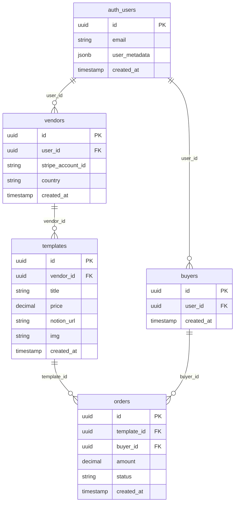

# Notion Template Shop

A modern marketplace for Notion templates built with Next.js 15, Supabase, and Stripe Connect. Vendors can sell their Notion templates while buyers can browse and purchase them through a seamless checkout experience.

## 🚀 Getting Started

First, run the development server:

```bash
npm run dev
# or
yarn dev
# or
pnpm dev
# or
bun dev
```

Open [http://localhost:3000](http://localhost:3000) with your browser to see the result.

## 🧪 Testing

### Automated Tests

Run the access control test suite to verify all security components:

```bash
node test-access-control.js
```

This will check:

- ✅ Middleware file existence and configuration
- ✅ Authentication utilities (`lib/auth-utils.ts`, `lib/api-client.ts`)
- ✅ Protected pages (`/vendor`, `/cart`, `/account`)
- ✅ Protected API routes (`/api/stripe/connect`, `/api/stripe/checkout`)
- ✅ Role-based navigation in navbar
- ✅ Documentation completeness

### Manual Testing Checklist

#### 1. Unauthenticated User Tests

- [ ] Visit `/vendor` → should redirect to `/auth/sign-in`
- [ ] Visit `/cart` → should redirect to `/auth/sign-in`
- [ ] Visit `/account` → should redirect to `/auth/sign-in`

#### 2. Buyer Role Tests

- [ ] Sign up as buyer
- [ ] Visit `/vendor` → should show "Access Denied"
- [ ] Visit `/cart` → should work normally
- [ ] Visit `/account` → should work normally
- [ ] Navbar should show Cart and Account links
- [ ] Role badge should display "buyer"

#### 3. Vendor Role Tests

- [ ] Sign up as vendor
- [ ] Visit `/cart` → should show "Access Denied"
- [ ] Visit `/account` → should show "Access Denied"
- [ ] Visit `/vendor` → should work normally
- [ ] Navbar should show Vendor Dashboard link
- [ ] Role badge should display "vendor"

#### 4. API Route Tests

- [ ] Call `/api/stripe/connect` without auth → should return 401
- [ ] Call `/api/stripe/connect` as buyer → should return 403
- [ ] Call `/api/stripe/checkout` without auth → should return 401
- [ ] Call `/api/stripe/checkout` as vendor → should return 403

#### 5. Middleware Tests

- [ ] Direct URL access to protected routes should be blocked
- [ ] Role-based redirects should work correctly
- [ ] Loading states should display during authentication checks

### Access Control Features

The application implements comprehensive role-based access control (RBAC):

#### Protected Routes

- **Vendor Routes**: `/vendor/*` - Only accessible to authenticated vendors
- **Buyer Routes**: `/cart/*`, `/account/*` - Only accessible to authenticated buyers

#### Security Layers

1. **Middleware Protection**: Route-level access control at the edge
2. **API Authentication**: Server-side JWT verification and role checking
3. **Page-Level Guards**: Client-side role verification with user-friendly error messages
4. **Role Isolation**: Vendors cannot access buyer features and vice versa

#### Authentication Flow

1. User signs in/up with role assignment
2. Middleware checks role on protected routes
3. API routes verify role via auth headers
4. Pages show appropriate content based on role
5. Automatic redirects for unauthorized access

## ✨ Features

### For Vendors

- **Protected Vendor Dashboard**: `/vendor` - Only accessible to authenticated vendors
- **Stripe Connect Integration**: Complete onboarding flow to receive payments directly
- **Template Management**: Add, edit, and delete templates with image uploads
- **Real-time Updates**: Templates appear on the main page immediately after creation
- **Image Upload**: Upload template preview images to Supabase Storage
- **Stripe Account Status**: Monitor your Stripe account activation status

### For Buyers

- **Browse Templates**: View all available templates from connected vendors
- **Shopping Cart**: Add templates to cart and manage purchases
- **Stripe Checkout**: Secure payment processing with Stripe
- **Email Delivery**: Receive template links via email after purchase
- **Template Details**: View detailed template information and previews
- **Account Management**: View order history and manage account settings

### Platform Features

- **10% Commission**: Platform takes 10% fee on all sales
- **Multi-vendor Support**: Each vendor has their own Stripe Connect account
- **Email Notifications**: Automated email delivery using Resend
- **Responsive Design**: Modern UI built with Tailwind CSS
- **TypeScript**: Full type safety throughout the application
- **Role-Based Access Control**: Comprehensive security with vendor/buyer isolation

## 🏗️ Architecture

### Tech Stack

- **Frontend**: Next.js 15 with App Router, React 19, TypeScript
- **Styling**: Tailwind CSS v4
- **Database**: Supabase (PostgreSQL)
- **Authentication**: Supabase Auth
- **Payments**: Stripe Connect for multi-vendor payments
- **File Storage**: Supabase Storage for template images
- **Email**: Resend for transactional emails

### Database Schema

The application uses the following database structure:



#### Tables and Columns

- **auth_users**: `id`, `email`, `user_metadata.role`, `created_at`
- **vendors**: `id`, `user_id`, `stripe_account_id`, `country`, `created_at`
- **templates**: `id`, `vendor_id`, `title`, `price`, `notion_url`, `img`, `created_at`
- **buyers**: `id`, `user_id`, `created_at`
- **orders**: `id`, `template_id`, `buyer_id`, `amount`, `status`, `created_at`

#### Key Features

- **Image Storage**: Templates include `img` field for preview images stored in Supabase Storage
- **Stripe Integration**: Vendors must complete Stripe Connect onboarding to receive payments
- **Order Tracking**: Complete order history with payment status tracking
- **Multi-vendor Support**: Each vendor has independent Stripe accounts
- **Role-based Access**: Users have roles (`vendor`/`buyer`) stored in `user_metadata`
- **Country Support**: Vendors specify their country for Stripe Connect onboarding

## 🔧 Environment Variables

Required environment variables:

```env
# Supabase Configuration
NEXT_PUBLIC_SUPABASE_URL=your_supabase_url
NEXT_PUBLIC_SUPABASE_ANON_KEY=your_supabase_anon_key
SUPABASE_SERVICE_ROLE_KEY=your_supabase_service_role_key

# Stripe Configuration
STRIPE_SECRET_KEY=your_stripe_secret_key
STRIPE_WEBHOOK_SECRET=your_stripe_webhook_secret

# Email Configuration
RESEND_API_KEY=your_resend_api_key

# Application Configuration
NEXT_PUBLIC_SITE_URL=your_site_url
```

## 📁 Project Structure

```markdown
notiontemplateshop/
├── app/                    # Next.js App Router
│   ├── api/               # API routes
│   │   ├── auth/          # Authentication endpoints
│   │   ├── checkout/      # Legacy checkout endpoint
│   │   ├── stripe/        # Stripe integration
│   │   ├── templates/     # Template management
│   │   └── webhook/       # Stripe webhooks
│   ├── auth/              # Authentication pages
│   ├── cart/              # Shopping cart
│   ├── dashboard/         # User dashboard
│   ├── templates/         # Template browsing
│   ├── vendor/            # Vendor dashboard
│   └── globals.css        # Global styles
├── lib/                   # Utility libraries
├── public/                # Static assets
└── supabase/              # Database configuration
```

## 💳 Payment Flow

1. **Vendor Onboarding**: Vendors sign up and connect their Stripe account
2. **Template Creation**: Vendors add templates with images and pricing
3. **Customer Purchase**: Customers browse and add templates to cart
4. **Checkout**: Stripe Checkout processes payment with 10% platform fee
5. **Order Processing**: Webhook creates order records and sends email
6. **Fund Transfer**: Money is transferred to vendor's Stripe account

## 🚀 Deployment

### Deploy on Vercel

The easiest way to deploy your Next.js app is to use the [Vercel Platform](https://vercel.com/new?utm_medium=default-template&filter=next.js&utm_source=create-next-app&utm_campaign=create-next-app-readme).

### Database Setup

1. Create a Supabase project
2. Run the schema migration from `supabase/schema.sql`
3. Set up Supabase Storage bucket `template-images`
4. Configure environment variables

### Stripe Setup

1. Create a Stripe account
2. Set up Stripe Connect for multi-vendor payments
3. Configure webhook endpoints
4. Set environment variables

## 🔍 Learn More

To learn more about the technologies used:

- [Next.js Documentation](https://nextjs.org/docs) - learn about Next.js features and API
- [Supabase Documentation](https://supabase.com/docs) - database and authentication
- [Stripe Connect Documentation](https://stripe.com/docs/connect) - multi-vendor payments
- [Tailwind CSS Documentation](https://tailwindcss.com/docs) - styling framework

## 📝 License

This project is licensed under the MIT License.
