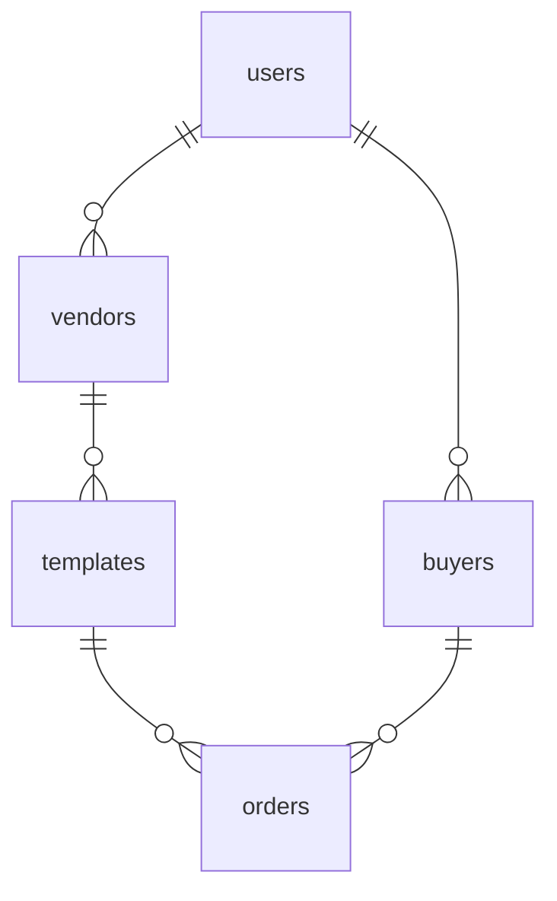

# Notion Template Shop

This is a [Next.js](https://nextjs.org) project bootstrapped with [`create-next-app`](https://nextjs.org/docs/app/api-reference/cli/create-next-app).

## Getting Started

First, run the development server:

```bash
npm run dev
# or
yarn dev
# or
pnpm dev
# or
bun dev
```

Open [http://localhost:3000](http://localhost:3000) with your browser to see the result.

You can start editing the page by modifying `app/page.tsx`. The page auto-updates as you edit the file.

This project uses [`next/font`](https://nextjs.org/docs/app/building-your-application/optimizing/fonts) to automatically optimize and load [Geist](https://vercel.com/font), a new font family for Vercel.

## Features

### Vendor Onboarding & Dashboard
- **Protected Route**: `/vendor` - Only accessible to authenticated vendors
- **Stripe Connect Integration**: Vendors can connect their Stripe accounts to receive payments
- **Template Management**: Vendors can add, view, and manage their templates
- **Real-time Updates**: Templates are fetched from the database and displayed on the main page

### Buyer Experience
- **Browse Templates**: View all available templates from connected vendors
- **Purchase Flow**: Buy templates through Stripe Checkout
- **Email Delivery**: Receive template links via email after purchase
- **Order History**: View past purchases on the account page

## Learn More

To learn more about Next.js, take a look at the following resources:

- [Next.js Documentation](https://nextjs.org/docs) - learn about Next.js features and API.
- [Learn Next.js](https://nextjs.org/learn) - an interactive Next.js tutorial.

You can check out [the Next.js GitHub repository](https://github.com/vercel/next.js) - your feedback and contributions are welcome!

## Deploy on Vercel

The easiest way to deploy your Next.js app is to use the [Vercel Platform](https://vercel.com/new?utm_medium=default-template&filter=next.js&utm_source=create-next-app&utm_campaign=create-next-app-readme) from the creators of Next.js.

Check out our [Next.js deployment documentation](https://nextjs.org/docs/app/building-your-application/deploying) for more details.

## Database schema

The tables used by this project can be created in Supabase using the SQL script
found at `supabase/schema.sql`.



Tables and columns:

- **auth.users**: `id`, `email`, `user_metadata.role`
- **vendors**: `id`, `user_id`, `stripe_account_id`, `created_at`
- **templates**: `id`, `vendor_id`, `title`, `price`, `notion_url`, `created_at`
- **buyers**: `id`, `user_id`, `created_at`
- **orders**: `id`, `template_id`, `buyer_id`, `amount`, `status`, `created_at`

## Environment Variables

Required environment variables:

```env
NEXT_PUBLIC_SUPABASE_URL=your_supabase_url
NEXT_PUBLIC_SUPABASE_ANON_KEY=your_supabase_anon_key
SUPABASE_SERVICE_ROLE_KEY=your_supabase_service_role_key
STRIPE_SECRET_KEY=your_stripe_secret_key
STRIPE_WEBHOOK_SECRET=your_stripe_webhook_secret
RESEND_API_KEY=your_resend_api_key
NEXT_PUBLIC_SITE_URL=your_site_url
```
